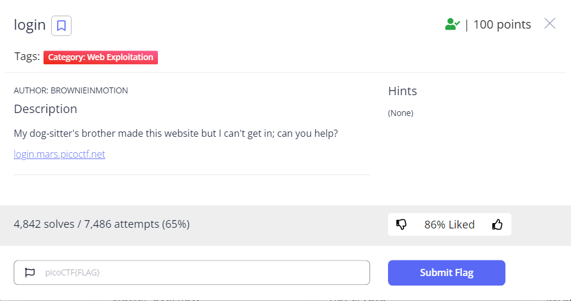
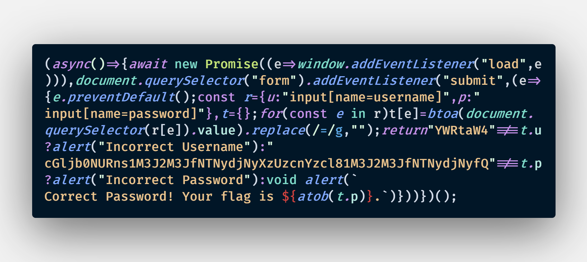
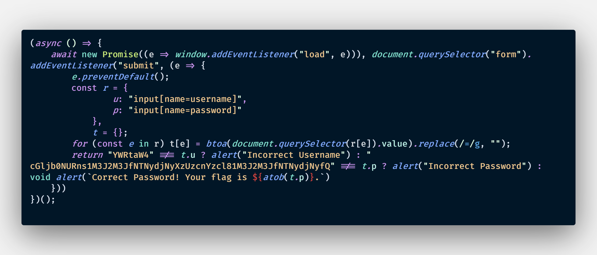

# WriteUp login
#### ***picoCTF***
___

>
<font size = 4px>Yêu cầu của thử thách:
>

>Giao diện khi truy cập vào trang web được cung cấp:


> Thử với SQL injection (:v) nhưng không được. Nên mở thử devtool và vào source thì phát hiện ra file index.js:


> Hơi khó đọc nên mình sẽ format lại cho dễ đọc.


> Chú ý ở dòng return, nó sẽ so sánh một chuỗi với user và password. Nhìn vào đoạn chuỗi so sánh ta đoán có thể chuỗi đã được mã hôá.
```scala
Check user: YWRtaW4
Check password: cGljb0NURns1M3J2M3JfNTNydjNyXzUzcnYzcl81M3J2M3JfNTNydjNyfQ
```
> Khi nhìn vào cuối thì flag được trả khi thi user và pass thỏa mãn. Trước khi in ra thì sẽ đi qua hàm atob(). Tham khảo [w3school](https://www.w3schools.com/jsref/met_win_atob.aspbase) thì atob() sẽ mã hóa chuỗi theo base64.
> Mở devtool và thử:


> Và ***bùm*** có kết quả. Thử vào user và pass.


> Có flag: ***picoCTF{53rv3r_53rv3r_53rv3r_53rv3r_53rv3r}***

### ***Nộp thôi!***